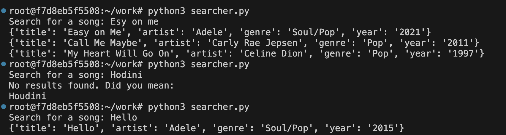

# SearchEngine

This is a PyLucene app that helps you find songs quickly by title. It can show exact matches and suggest similar titles if you misspell or approximate the search.

## Roadmap

- Prerequisites

- Installation

- Code Overview

- Example Usage

- Author
## Prerequisites

- Docker
- Python 3

## Installation

1. **Pull the PyLucene Docker Image:**

    ```bash
    docker pull coady/pylucene
    ```

2. **Run the Docker Container:**

    ```bash
    docker run -it --rm --name lucene-container coady/pylucene
    ```

    Connect this container to your IDE for development.

3. **Prepare the Index:**

    We have a CSV file named `songs.csv` with the following columns: `title`, `artist`, `genre`, `year`.

4. **Index the Data:**

    Run the indexer script to create the Lucene index:

    ```bash
    python3 indexer.py
    ```

5. **Search the Index:**

    Use the searcher script to perform searches:

    ```bash
    python3 searcher.py
    ```

    ## Code Overview

### `indexer.py`

This script initializes Lucene, reads a CSV file, and creates an index. Each document in the index contains fields for `title`, `artist`, `genre`, and `year`.

### `searcher.py`

This script initializes Lucene and provides functions for searching and suggesting alternatives based on user input. It supports fuzzy searching for misspelled queries.

## Example Usage

To search for a song by title, run `searcher.py` and enter the query when prompted. The script will return matching results and suggest alternatives if no matches are found.





## Note
This project is a basic demo and has its limitations. There's still room for improvement. To create a truly advanced search, more development is required. This just showcases what PyLucene can do.

## Author

- [Agni Ramadani](https://github.com/agniramadani)
